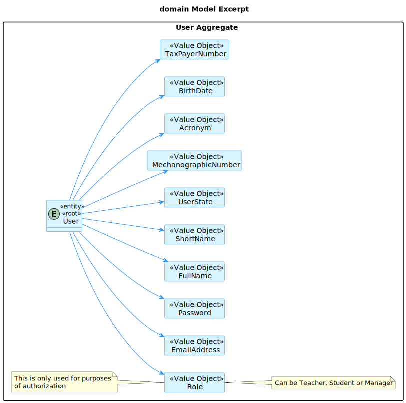

# US G006

## 1. Context

*In this User Story, the Project Manager wants us to incorporate Authentication and Authorization in our System, in order to give access accordingly to the application(s).*

## 2. Requirements

**US G006** - As a **Project Manager**, I want the system to support and apply authentication and authorization for all its users and functionalities.

- G006.1. Firstly, we shall implement authentication so no intruder can access the system.

- G006.2. Only and only then, we shall implement authorization so that each user can access its functionalities accordingly.

- G006.3. The system must **never** persist the real password of the users. An encryption algorithm must be used to store the password(and a decryption one to check it).

*Regarding this requirement we understand that it relates to the security of our system, and it has extreme importance.*

## 3. Analysis



- This is an excerpt of our Domain Model, it gives us the clear idea of how the User should be identified in order to perform authentication, and it also distinguishes its paper in the system, that will be used to perform authorization.
- Our use case diagram is still not much relevant for this since this feature does not have any dependencies, it is the main dependency for the rest of the system (a user must be logged in and have permission to perform most, if not all use cases).

## 4. Design

### 4.1. Realization

#### 4.1.1. Sequence Diagram of the Authentication


- After User inputs its data, the authenticaction service will check if the user exists by its repository
- If the user exists, the service will ask the user class to check if the raw password is the same as the decrypted one that we got from our repository
- It will also ask the user to check if its role is present in the provided list of accepted roles to that application
- If the user is valid, the service will call the authorization service and ask it to create a user session, returning an optional, that may have a user session if login was valid, and may have a null pointer if login was not valid

#### 4.1.2. Sequence Diagram of the Authorization


- In each use case, the user will be verified, its role will be checked (needs to be in  the list of accepted roles for that use case) and then the use case will be performed.

#### 4.1.3. Sequence Diagram for the AuthzRegistry setup


- The authzregistry is a tool that will register how the authentication and authorization will be run. For example, in the configure method we specify if we want to access a "in-memory" database or a server database, we also specify the password encoding algorithm and the password policy to be used.

### 4.2. Class Diagram

#### 4.2.1. Authentication and Authorization class diagram

- Through the *authentication service*, the user will be able to login into its own application, depending on its roles.
- The *authentication service* will be responsible for checking if the role of the user is valid to the corresponding use case they might want to perform.

### 4.3. Applied Patterns

#### 4.3.1. Factory

- Our PersistenceContext will create a RepositoryFactory based on the configuration file, and then the RepositoryFactory will create the repository that we need in order to persist our domain entity.

#### 4.3.2. Single Responsibility Principle

- Every class has a purpose. Each class will be responsible for its own validation and its own purpose, DDD is a perfect example of that, since, for example, our User's Email will be validated by the Email class and not the User class.
- But regarding examples, this is a good principle, so we know where our functions are based on what they do.

#### 4.3.3. Open/Closed Principle

- For this principle in specific, we chose to do a more abstract approach, then implement what we need, so if we need to extend our system, we don't need to change classes, rather we implement a new one and extend the behaviours of the pre-existing ones.
- For example, if we want to add a new database technology we just need to extend the PersistenceContext class and implement the new database technology(new repository implementations).

#### 4.3.4. Repository Pattern

- The repository pattern is a pattern that allows us to abstract the data access layer, so we can change the database technology without changing the rest of the system.
- New Programmers might not know how to use a specific database technology, but they will know how to use the repository pattern, so they can implement the repository pattern and use it in the system.
- In our case, we will have a interface repository that shows us different functionalities we can use, and then we will have its own implementations with their own specific database technology.

### 4.4. Tests

**Test 1:** *Verifies that it is not possible to create an instance of the Example class with null values.*

```
@Test(expected = IllegalArgumentException.class)
public void ensureNullIsNotAllowed() {
	Example instance = new Example(null, null);
}
````

## 5. Implementation

*In this section the team should present, if necessary, some evidencies that the implementation is according to the design. It should also describe and explain other important artifacts necessary to fully understand the implementation like, for instance, configuration files.*

*It is also a best practice to include a listing (with a brief summary) of the major commits regarding this requirement.*

## 6. Integration/Demonstration

*In this section the team should describe the efforts realized in order to integrate this functionality with the other parts/components of the system*

*It is also important to explain any scripts or instructions required to execute an demonstrate this functionality*

## 7. Observations

*This section should be used to include any content that does not fit any of the previous sections.*

*The team should present here, for instance, a critical prespective on the developed work including the analysis of alternative solutioons or related works*

*The team should include in this section statements/references regarding third party works that were used in the development this work.* 
