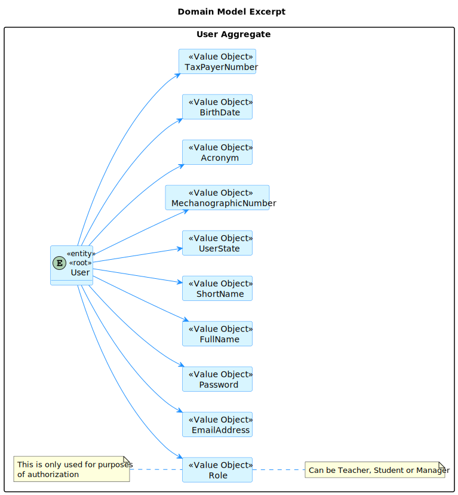
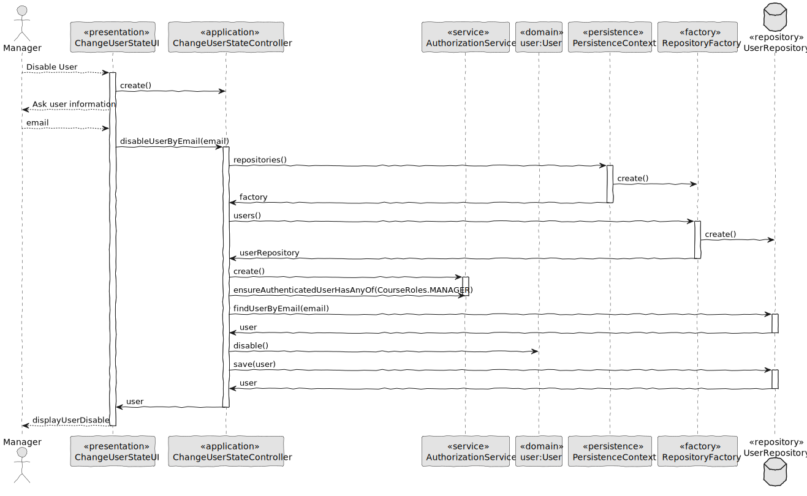
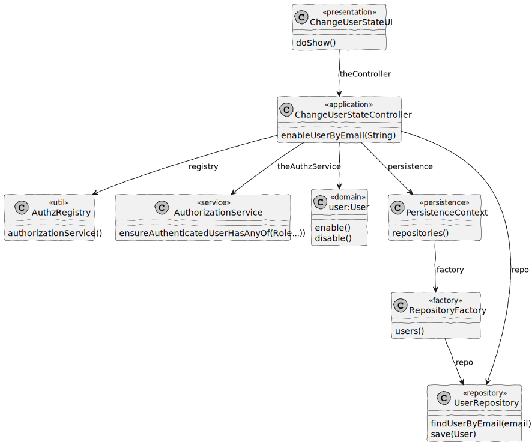

# US 1001 - Change User State

## 1. Context

In Sprint B client wants us to develop a feature for our System. He wants that a Manager to be able to disable/enable, Teachers and Students, as well as Managers.

## 2. Requirements

As Manager, I want to be able to disable/enable users of the system 

## 3. Analysis

Information in System Specification

	FRU01 - Management of Users Create, disable/enable, and list users of the system(Teachers and Students, as well as Managers)


This is an excerpt of our domain Model, it provides the clear idea of how the User should be identified according to the information in System Specification.



We added the UserState as a Value Object of the User so that it is easy to know which users are enable and which are disable.

### 4.1. Realization

#### 4.1.1. Sequence Diagram Enable User


#### 4.1.2. Sequence Diagram Disable User



### 4.2. Class Diagram

#### 4.2.1 Class Diagram Change User State Enable/Disable




### 4.3. Applied Patterns

#### 4.3.1. Factory

- Our PersistenceContext will create aRepositoryFactory based on theconfiguration file then theRepositoryFactory will create the repositorythat we needin order topersist our domain entity.

#### 4.3.2 Single Responsibility Principle (SRP)

- Ensure that each object has a clear and well-defined responsibility within the domain.

#### 4.3.3 Tell, Don't Ask

- Ensure that objects do not expose their internal state or behaviour to the outside world. On the contrary, objects should receive commands telling them what they should do, rather than being asked for information about their current state.

#### 4.3.4 Singleton Pattern

- Only one instance, and provides a global point of access to that instance. 
- The Authentication Registry is a singleton, since from thisclass we can only get aninstance of the authentication service, the authorization service and the user management service. 

#### 4.3.5 Model-View-Controller (MVC)

- Model is responsible for managing the data and business logic of the application. (AuthorizationService)
- View is responsible for presenting the data to the user in a human-readable format. (ChangeUserStateUI)
- Controller is responsible for handling the user input and updating the model and the view accordingly. (ChangeUserStateController)


### 4.4. Tests

**Test 1:** *Verifies that it is not possible to create an instance of the Example class with null values.*

```Java
@Test(expected = IllegalArgumentException.class)
public void ensureNullIsNotAllowed() {
	Example instance = new Example(null, null);
}
````

## 5. Implementation

*In this section the team should present, if necessary, some evidencies that the implementation is according to the design. It should also describe and explain other important artifacts necessary to fully understand the implementation like, for instance, configuration files.*

*It is also a best practice to include a listing (with a brief summary) of the major commits regarding this requirement.*

## 6. Integration/Demonstration

*In this section the team should describe the efforts realized in order to integrate this functionality with the other parts/components of the system*

*It is also important to explain any scripts or instructions required to execute an demonstrate this functionality*

## 7. Observations

*This section should be used to include any content that does not fit any of the previous sections.*

*The team should present here, for instance, a critical prespective on the developed work including the analysis of alternative solutioons or related works*

*The team should include in this section statements/references regarding third party works that were used in the development this work.*