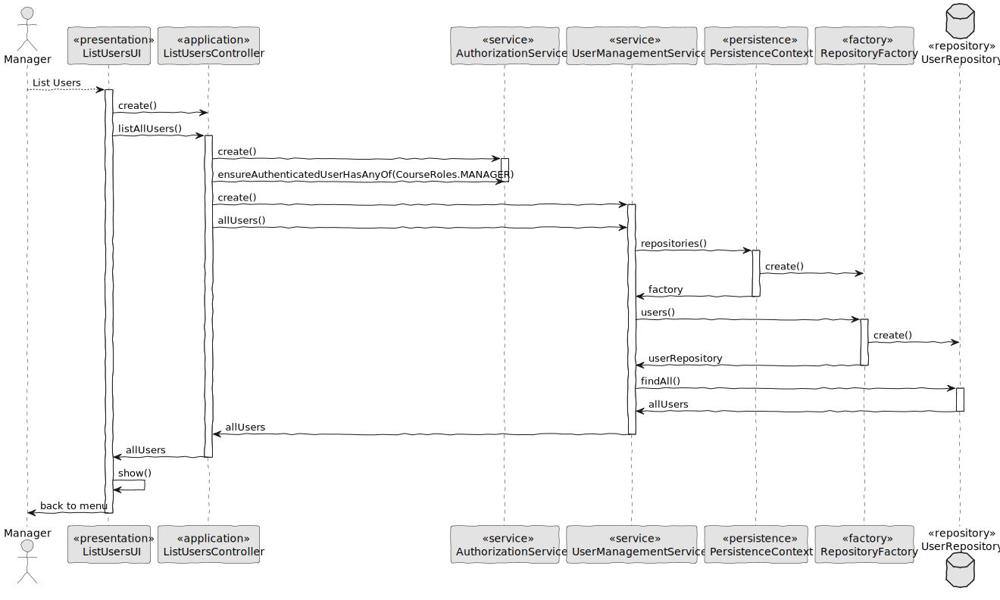

# US 1001 - List Users

## 1. Context

In Sprint B client wants us to develop a feature for our System. He wants that a Manager to be able to list Teachers and Students, as well as Managers.

## 2. Requirements

As Manager, I want to be able to list users of the system

## 3. Analysis

Information in System Specification

	FRU01 - Management of Users Create, disable/enable, and list users of the system(Teachers and Students, as well as Managers)~

Information in Forum

	"Is it necessary to know who created a specific user? There is no requirement specific to all these questions. However, I do not know if the system must support "something" related to these questions. I think this is something related to the design of the solution, that you and your team must decide when designing the solution in order to meet the existing requirements."

## 4. Design

### 4.1. Realization

#### 4.1.1. Sequence Diagram List Users



### 4.2. Class Diagram List Users


### 4.3. Applied Patterns

#### 4.3.1. Factory

- Our PersistenceContext will create aRepositoryFactory based on theconfiguration file then theRepositoryFactory will create the repositorythat we needin order topersist our domain entity.


#### 4.3.2 Service

- Services are operations or functions thatarenot naturallyin line with the responsibility of an entity or value object. They are used to model operations that involve multiple objects or complexbehaviour.


#### 4.3.3 Single Responsibility Principle (SRP)

- Ensure that each object has a clear and well-defined responsibility within the domain.

#### 4.3.4 Tell, Don't Ask

- Ensure that objects do not expose their internal state or behaviour to the outside world. On the contrary, objects should receive commands telling them what they should do, rather than being asked for information about their current state.

#### 4.3.5 Singleton Pattern

- Only one instance, and provides a global point of access to that instance. 
- The Authentication Registry is a singleton, since from thisclass we can only get aninstance of the authentication service, the authorization service and the user management service.


#### 4.3.6 Model-View-Controller (MVC)

- Model is responsible for managing the data and business logic of the application. (UserManagementService, AuthorizationService)
- View is responsible for presenting the data to the user in a human-readable format. (ListUsersUI)
- Controller is responsible for handling the user input and updating the model and the view accordingly. (ListUsersController)


### 4.4. Tests

**Test 1:** *Verifies that it is not possible to create an instance of the Example class with null values.*

```Java
@Test(expected = IllegalArgumentException.class)
public void ensureNullIsNotAllowed() {
	Example instance = new Example(null, null);
}
````

## 5. Implementation

*In this section the team should present, if necessary, some evidencies that the implementation is according to the design. It should also describe and explain other important artifacts necessary to fully understand the implementation like, for instance, configuration files.*

*It is also a best practice to include a listing (with a brief summary) of the major commits regarding this requirement.*

## 6. Integration/Demonstration

*In this section the team should describe the efforts realized in order to integrate this functionality with the other parts/components of the system*

*It is also important to explain any scripts or instructions required to execute an demonstrate this functionality*
