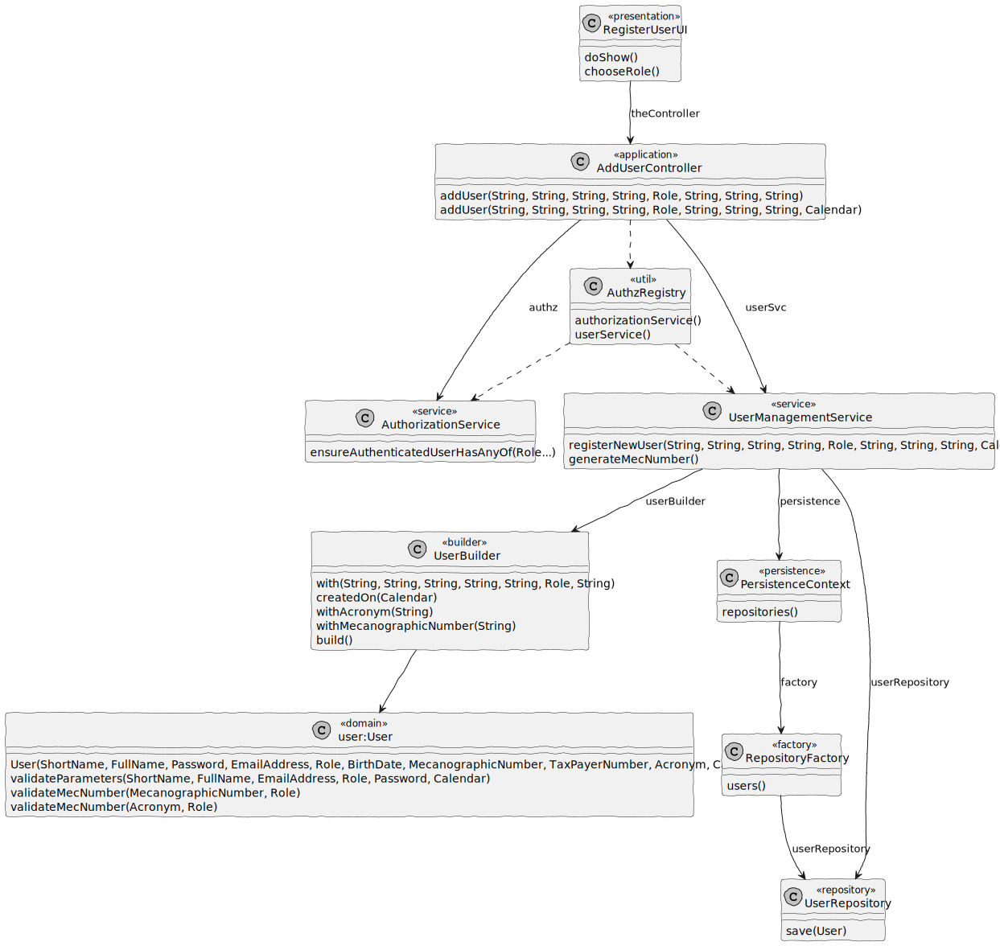

# US 1001 - Register User

## 1. Context

In Sprint B client wants us to develop a feature for our System. He wants that a Manager to be able to register Teachers and Students, as well as Managers.

## 2. Requirements

As Manager, I want to be able to register Teachers and Students, as well as Managers

## 3. Analysis
Information in System Specification

	All users should be identified in the system by their email. Each user should also provide its full name and short name. In order to be authenticated by the system the users must also provide a password.

	Managers - Managers (they can be also named as Administrators) manage all the users of the system

	Teacher - "A Teacher is characterized by his/her name, date of birth, tax payer number and an acronym inputed by the administrator (e.g., "AALB")"

	Student - A student is characterized by his/her name, date of birth, tax payer number and a mechanographic number assigned automatically by the system based on the year of registration and a sequential number, e.g., "202300001".

This is an excerpt of our domain Model, it provides the clear idea of how the User should be identified according to the information in System Specification.


So all users should have:
- Email
- Full Name
- Short Name
- Password
- Birth Date
- Tax Payer Number

Teachers should have Acronym

Students should have Mechanographic Number

## 4. Design

### 4.1. Realization

#### 4.1.1. Sequence Diagram Register User


### 4.2. Class Diagram Register User



### 4.3. Applied Patterns

#### 4.3.1. Factory

- Our PersistenceContext will create aRepositoryFactory based on theconfiguration file then theRepositoryFactory will create the repositorythat we needin order topersist our domain entity.

#### 4.3.2 Service

- Services are operations or functions thatarenot naturallyin line with the responsibility of an entity or value object. They are used to model operations that involve multiple objects or complexbehaviour.

#### 4.3.3 Single Responsibility Principle (SRP)

- Ensure that each object has a clear and well-defined responsibility within the domain.

#### 4.3.4 Tell, Don't Ask

- Ensure that objects do not expose their internal state or behaviour to the outside world. On the contrary, objects should receive commands telling them what they should do, rather than being asked for information about their current state.

#### 4.3.5 Singleton Pattern

- Only one instance, and provides a global point of access to that instance. 
- The Authentication Registry is a singleton, since from thisclass we can only get aninstance of the authentication service, the authorization service and the user management service. 

#### 4.3.6 Model-View-Controller (MVC)

- Model is responsible for managing the data and business logic of the application. (UserManagementService, AuthorizationService)
- View is responsible for presenting the data to the user in a human-readable format. (AddUserUI)
- Controller is responsible for handling the user input and updating the model and the view accordingly. (AddUserController)


### 4.4. Tests

**Test 1:** *Verifies that it is not possible to create an instance of the Example class with null values.*

```Java
@Test(expected = IllegalArgumentException.class)
public void ensureNullIsNotAllowed() {
	Example instance = new Example(null, null);
}
````

## 5. Implementation

*In this section the team should present, if necessary, some evidencies that the implementation is according to the design. It should also describe and explain other important artifacts necessary to fully understand the implementation like, for instance, configuration files.*

*It is also a best practice to include a listing (with a brief summary) of the major commits regarding this requirement.*

## 6. Integration/Demonstration

*In this section the team should describe the efforts realized in order to integrate this functionality with the other parts/components of the system*

*It is also important to explain any scripts or instructions required to execute an demonstrate this functionality*
