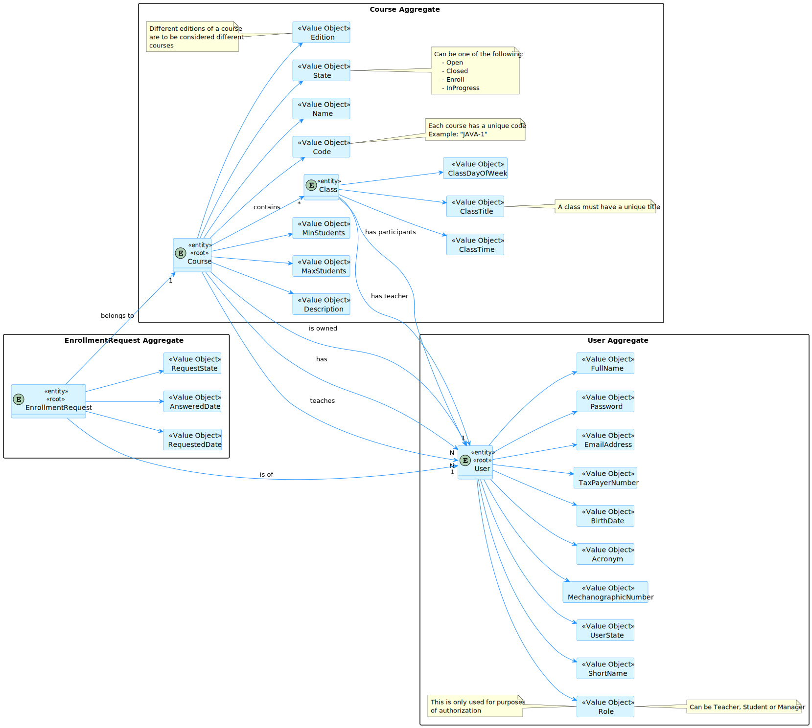
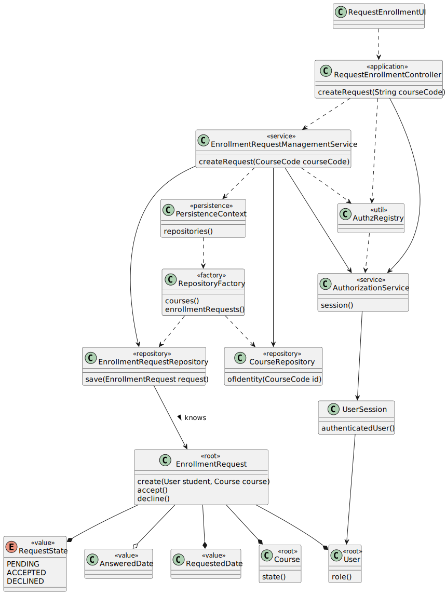

# US 1008 - As a Student, I want to request my enrollment in a course.

## 1. Context

In order for the student to be able to attend to classes of a course, the student needs to be enrolled in the correspondent course, so he needs to make a request to enroll, and then it is the manager's responsibility to accept or reject the request.
This User Story will be handling the request of the student to enroll in a course.

## 2. Requirements

As a student, I shall provide the course code of the course I want to enroll in.
However, I can only enroll in a course if I am not already enrolled in it and the course state is "Open for Enrollment" (CourseStateConstants.ENROLL in our app).

## 3. Analysis


- We have chosen to create a concept of "Enrollment request" that is used to connect a course and a user, in a way that does not say that the user is already enrolled, it says that the user is yet to be accepted or declined.

## 4. Design

### 4.1. Realization


### 4.2. Class Diagram


- The controller uses a service that manages requests to create the request with the current user session.
- This makes it so that the controller is only responsible for guiding the user story and not perform business logic.
- For easier application use, we made this user story dependent on US 1006, so we only need to type the course code and not select it from a list.
- The only input is a string, our application will manage the rest.

### 4.3. Applied Patterns

### 4.4. Tests

**Test 1:** *Verifies that it is not possible to create an instance of the Example class with null values.*

```
@Test(expected = IllegalArgumentException.class)
public void ensureNullIsNotAllowed() {
	Example instance = new Example(null, null);
}
````

## 5. Implementation

*In this section the team should present, if necessary, some evidences that the implementation is according to the design. It should also describe and explain other important artifacts necessary to fully understand the implementation like, for instance, configuration files.*

*It is also a best practice to include a listing (with a brief summary) of the major commits regarding this requirement.*

## 6. Integration/Demonstration

*In this section the team should describe the efforts realized in order to integrate this functionality with the other parts/components of the system*

*It is also important to explain any scripts or instructions required to execute and demonstrate this functionality*

## 7. Observations

*This section should be used to include any content that does not fit any of the previous sections.*

*The team should present here, for instance, a critical perspective on the developed work including the analysis of alternative solutions or related works*

*The team should include in this section statements/references regarding third party works that were used in the development this work.* 
