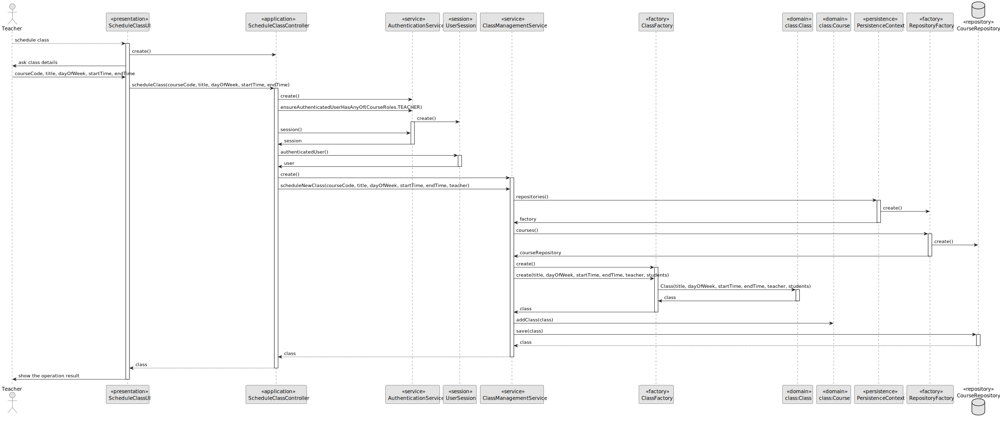

# US 1010

## 1. Context

This is the first time this task is being developed, since it was assigned in the present sprint (Sprint B).

This [User Story](../../Glossary.md)  relates [Teachers](../../Glossary.md), [Courses](../../Glossary.md) and [Classes](../../Glossary.md).

Teachers are responsible for scheduling classes. A class is always a recurring weekly event.  A class must have a **unique title**, **date** and **duration**.

## 2. Requirements

**US 1010** As Teacher, I want to schedule a class.

- The Teacher can only schedule a class if they are set in the course.
- The Teacher can only schedule a class if they do not have a class scheduled at the same time.
- The Teacher can only schedule a class if there are no other classes of the same course scheduled at the same time.
- The System warns if one of the participants in the class (either a teacher or a student) has other classes at the same time.

Regarding these requirements we understand that this User Story relates to [US1006](../US_1006/readme.md).

### 2.1 Client Specifications


## 3. Analysis

### 3.1. Domain Model


### 3.2 Implementation Analysis

After analyzing the requirements and the dependencies of this User Story, we concluded that the following classes are involved in this functionality:

- **ScheduleClassUI (UI)** - The user interface of the functionality.
- **ScheduleClassController (Controller)** - The controller of the functionality.
- **ClassManagementService (Service)** - The service of the functionality.
- **ClassBuilder (Builder)** - The builder of the functionality. It is used to build a class.
- **PersistenceContext (Persistence)** - The persistence context of the functionality.
- **RepositoryFactory (Factory)** - The repository factory of the functionality.
- **ClassRepository (Repository)** - The repository of the functionality.
- **Class (Domain)** - The domain class of the functionality.

## 4. Design

### 4.1. Sequence Diagram



### 4.2. Class Diagram


### 4.3. Applied Patterns

Some main design patterns were applied in this functionality, namely:
- **Single Responsibility Principle (SRP)**: A class should have only one reason to change and only one responsibility.
  - For example, in this User Story, every class has only one responsibility. For example, the class `Class` has only one responsibility: to represent a class.
- **Open/Closed Principle (OCP)**: Software entities (classes, modules, functions, etc.) should be open for extension, but closed for modification.
  - For example, in this User Story, the class `Class` is open for extension, since it is possible to extend it with new attributes and methods. However, it is closed for modification, since it is not possible to modify the existing attributes and methods.
- **High Cohesion**: A class should have a single, well-defined purpose.
  - For example, in this User Story, the class `Class` has a single, well-defined purpose: to represent a class.
- **Low Coupling**: Classes should depend on abstractions, not on concretions.
  - For example, in this User Story, the class `Class` depends on the abstraction `ClassRepository`, not on the concretion `ClassRepositoryImpl`.


### 4.4. Tests

**Test 1:** *Verifies that it is not possible to create an instance of the Example class with null values.*

```
@Test(expected = IllegalArgumentException.class)
public void ensureNullIsNotAllowed() {
	Example instance = new Example(null, null);
}
````

## 5. Implementation

*In this section the team should present, if necessary, some evidencies that the implementation is according to the design. It should also describe and explain other important artifacts necessary to fully understand the implementation like, for instance, configuration files.*

*It is also a best practice to include a listing (with a brief summary) of the major commits regarding this requirement.*

## 6. Integration/Demonstration

*In this section the team should describe the efforts realized in order to integrate this functionality with the other parts/components of the system*

*It is also important to explain any scripts or instructions required to execute an demonstrate this functionality*

## 7. Observations

*This section should be used to include any content that does not fit any of the previous sections.*

*The team should present here, for instance, a critical prespective on the developed work including the analysis of alternative solutioons or related works*

*The team should include in this section statements/references regarding third party works that were used in the development this work.* 