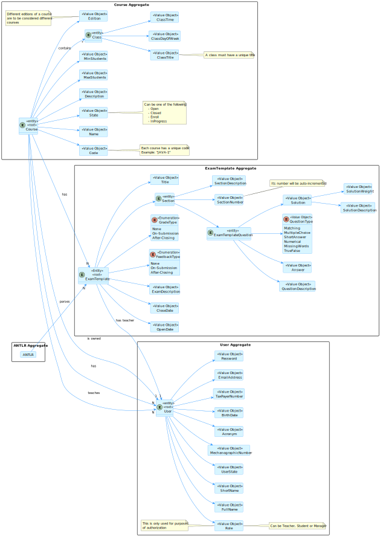
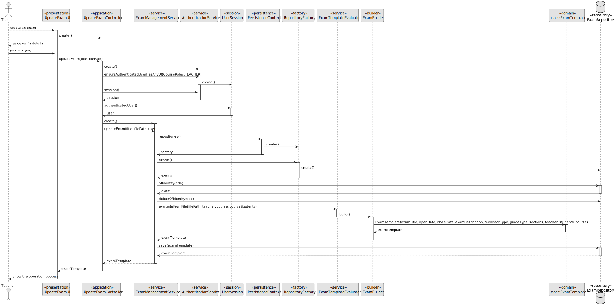
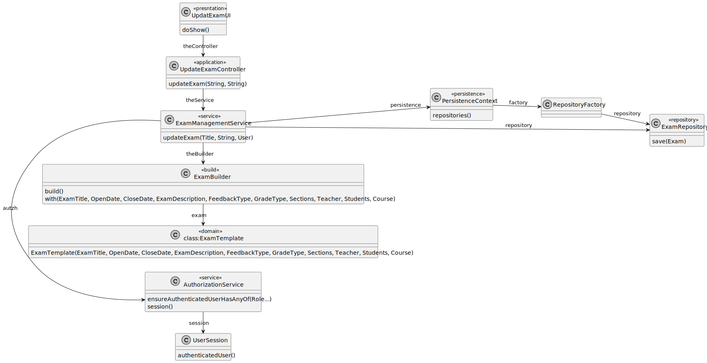
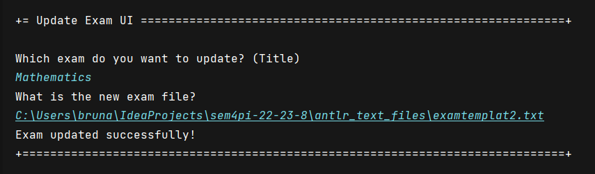
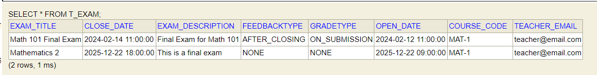

# US 2001.1

## 1. Context

This is the first time this task is being developed, since it was assigned in the present sprint (Sprint B).

This [User Story](../../Glossary.md)  relates [Teachers](../../Glossary.md), [Courses](../../Glossary.md) and [Exams](../../Glossary.md).

Teachers are responsible for creating and updating exams. An exam is related to a specific course and has a **unique title**, **header**, **open date** and **close date**.

The exam's header includes global settings such as the type of **feedback** (none, on-submission, after-closing) and the type of **grade** (none, on-submission, after-closing). It may also contain a **description**.

An exam must have at least one **section**. A section is a set of **questions** that are related to a specific topic and may contain a **description** which explains the section's topic. The section's **title** includes their number.

There are six different question types: **matching**, **multiple choice**, **short answer**, **numerical**, **select missing words** and **true/false**. Each question type has its own settings.

## 2. Requirements

**US 2001** As Teacher, I want to create an exam.

- The Teacher can only update an exam if there is at least one exam previously created.

Regarding these requirements we understand that this User Story relates to [US1006](../US_1006/readme.md).

## 3. Analysis

### 3.1. Domain Model



### 3.2 Implementation Analysis

After analyzing the requirements and the dependencies of this User Story, we concluded that the following classes are involved in this functionality:

- **UpdateExamUI (UI)** - The user interface of the functionality.
- **UpdateExamController (Controller)** - The controller of the functionality.
- **ExamManagementService (Service)** - The service of the functionality.
- **ExamBuilder (Builder)** - The builder of the functionality. It is used to build a class.
- **PersistenceContext (Persistence)** - The persistence context of the functionality.
- **RepositoryFactory (Factory)** - The repository factory of the functionality.
- **ExamRepository (Repository)** - The repository of the functionality.
- **ExamTemplate (Domain)** - The domain class of the functionality.

## 4. Design

### 4.1. Sequence Diagram



### 4.2. Class Diagram



### 4.3. Applied Patterns

Some main design patterns were applied in this functionality, namely:
- **Single Responsibility Principle (SRP)**: A class should have only one reason to change and only one responsibility.
    - For example, in this User Story, the class `CreateExamController` has the responsibility of controlling the creation of an exam.
- **Service Layer**: Defines an application's boundary with a layer of services that establishes a set of available operations and coordinates the application's response in each operation.
  - For example, in this User Story, the class `ExamManagementService` is a service layer, since it defines the application's boundary with a layer of services that establishes a set of available operations and coordinates the application's response in each operation.
- **Builder**: It is used to build a class.
  - For example, in this User Story, the class `ExamBuilder` is a builder, since it is used to build the class `ExamTemplate`.

## 5. Implementation

**UpdateExamUI**

```java
public class UpdateExamUI extends AbstractUI {

    Scanner scanner = new Scanner(System.in);

    private final UpdateExamController ctrl = new UpdateExamController(AuthzRegistry.authorizationService());

    @Override
    protected boolean doShow() {

        try {

            System.out.println("Which exam do you want to update? (Title)");
            String title = scanner.nextLine();

            System.out.println("What is the new exam file?");
            String filePath = scanner.nextLine();

            ExamTemplate exam = ctrl.updateExam(title, filePath);

            System.out.println("Exam updated successfully!");

        } catch(IllegalArgumentException iae){
            System.out.println(iae.getMessage());
        } catch(IOException ioe){
            System.out.println("File doesn't exist or is not accessible.\nTry again.");
        }

        return true;

    }

    @Override
    public String headline() {
        return "Update Exam UI";
    }
}
```

**UpdateExamController**

```java
public class UpdateExamController {

    private final ExamManagementService service;


    private final AuthorizationService authz;

    public UpdateExamController() {
        this.authz = null;
        this.service = null;
    }

    public UpdateExamController(
            final AuthorizationService authzServicep
    ) {
        this.authz = authzServicep;
        this.service = new ExamManagementService(
                PersistenceContext.repositories().exams(),
                PersistenceContext.repositories().courses()
        );
    }

    public ExamTemplate updateExam(String title,
                                   String filePath) throws IOException  {
        authz.ensureAuthenticatedUserHasAnyOf(CourseRoles.TEACHER);

        UserSession session = authz.session().orElse(null);

        assert session != null;
        User teacher = session.authenticatedUser();

        return service.updateExam(ExamTitle.of(title), filePath, teacher);
    }

}
```
## 6. Integration/Demonstration





