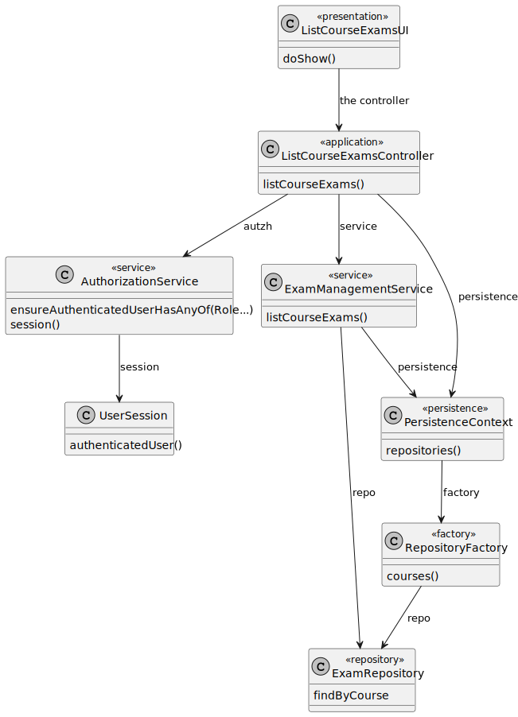

# US 2003

## 1. Context

This is the first time this task is being developed, since it was assigned in the present sprint (Sprint B).

This [User Story](../../Glossary.md)  relates [Teachers](../../Glossary.md), [Courses](../../Glossary.md) and [Exams](../../Glossary.md).

Teachers can view all the exams of a course. An exam is related to a specific course and has a **unique title**, **description**, **open date** and **close date**.

## 2. Requirements

**US 2003** As Teacher, I want to view a list of all exams in a course.

- The Teacher can only view the exams of a course if they are set in the course.
- The Teacher can only view the exams of a course if the course has exams.

Regarding these requirements we understand that this User Story relates to [US2001](../US_2001/readme.md).

## 3. Analysis

After analyzing the requirements and the dependencies of this User Story, we concluded that the following classes should be created:

## 4. Design

### 4.1. Sequence Diagram


### 4.2. Class Diagram



### 4.3. Applied Patterns

Some main design patterns were applied in this functionality, namely:
- **Single Responsibility Principle (SRP)**: A class should have only one reason to change and only one responsibility.
    - For example, in this User Story,
- **Open/Closed Principle (OCP)**: Software entities (classes, modules, functions, etc.) should be open for extension, but closed for modification.
    - For example, in this User Story,

### 4.4. Tests

**Test 1:** *Verifies that it is not possible to create an instance of the Example class with null values.*

```
@Test(expected = IllegalArgumentException.class)
public void ensureNullIsNotAllowed() {
	Example instance = new Example(null, null);
}
````

## 5. Implementation

*In this section the team should present, if necessary, some evidencies that the implementation is according to the design. It should also describe and explain other important artifacts necessary to fully understand the implementation like, for instance, configuration files.*

*It is also a best practice to include a listing (with a brief summary) of the major commits regarding this requirement.*

## 6. Integration/Demonstration

*In this section the team should describe the efforts realized in order to integrate this functionality with the other parts/components of the system*

*It is also important to explain any scripts or instructions required to execute an demonstrate this functionality*

## 7. Observations

*This section should be used to include any content that does not fit any of the previous sections.*

*The team should present here, for instance, a critical prespective on the developed work including the analysis of alternative solutioons or related works*

*The team should include in this section statements/references regarding third party works that were used in the development this work.* 
