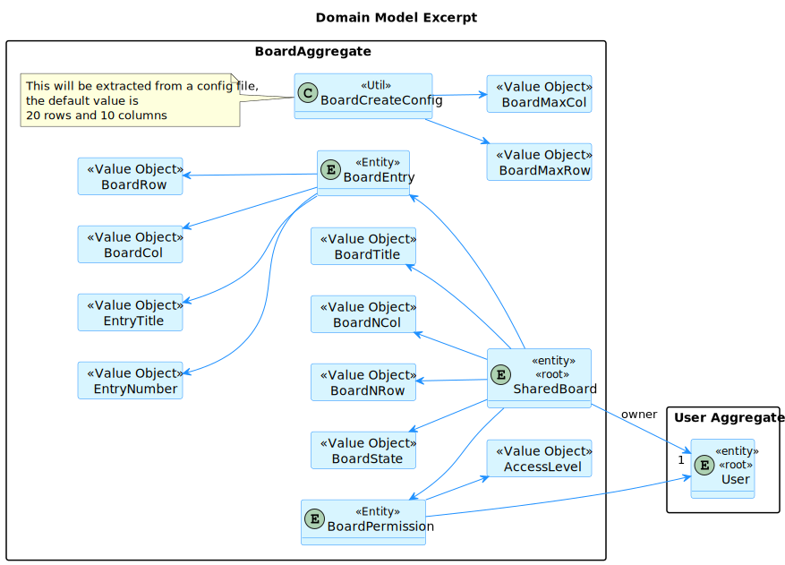
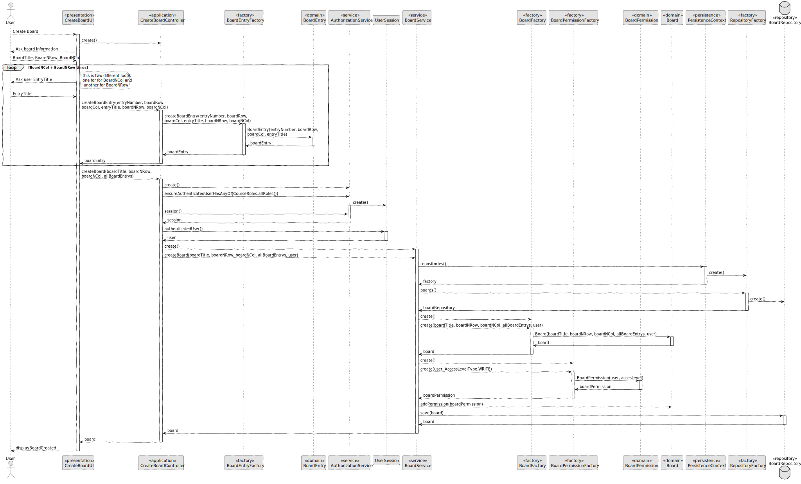
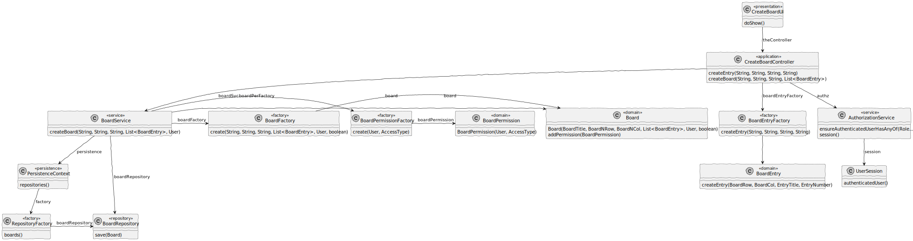

# US 3002

## 1. Context

In Sprint B client wants us to develop a feature for our System. He wants that a User to be able to create a board

## 2. Requirements

As User, I want to create a board.

The only dependecy is User needs to be authenticated to access to this feature.


## 3. Analysis

Information in System Specification

    It has a unique title. It is divided into a certain number of columns and rows. Therefore it has a certain number of cells. 
    For the moment it makes sense to define the maximum number of rows to 20 and of columns to 10. But this should be a setting in a property file.
    Columns and rows may have titles. They may also be identified by an integer number from 1 to the maximum number.
    The user that creates the board is its owner. The owner can share the board with other users.
    Users may have read or write access to the board.

Information in Forum

    "Can a user own more than one board?" 
    Yes.

    "As stated in the system specifications document, "Columns and rows may have titles. They may also be identified by an integer number from 1 to the maximum number", we wanted to clarify if it should be possible to have a column with no title and no identifier.Also, can the identifier of a column/row change once it's assigned?"

    In order for user to post content into a cell they must identify the cell. Therefore, I think at least, ir should be possible to identify the cell by the number of its column and the number of its row. If the cells have titles, these titles can be used to identify the cells. However, it should always be possible to identify a cell by the column number and row number.
    Regarding changing the title of the columns and rows after creating the board, there is nothing explicit about that. Therefore, I would accept the solution that does not support that possibility.

This is an excerpt of our domain Model, it provides the clear idea of how the Shared Board should be identified according to the information in System Specification.



## 4. Design

*In this sections, the team should present the solution design that was adopted to solve the requirement. This should include, at least, a diagram of the realization of the functionality (e.g., sequence diagram), a class diagram (presenting the classes that support the functionality), the identification and rational behind the applied design patterns and the specification of the main tests used to validade the functionality.*

### 4.1. Realization

#### 4.1.1. Sequence Diagram



### 4.2. Class Diagram



### 4.3. Applied Patterns

### 4.4. Tests

**Test 1:** *Verifies that it is not possible to create an instance of the Example class with null values.*

```
@Test(expected = IllegalArgumentException.class)
public void ensureNullIsNotAllowed() {
	Example instance = new Example(null, null);
}
````

## 5. Implementation

*In this section the team should present, if necessary, some evidencies that the implementation is according to the design. It should also describe and explain other important artifacts necessary to fully understand the implementation like, for instance, configuration files.*

*It is also a best practice to include a listing (with a brief summary) of the major commits regarding this requirement.*

## 6. Integration/Demonstration

*In this section the team should describe the efforts realized in order to integrate this functionality with the other parts/components of the system*

*It is also important to explain any scripts or instructions required to execute an demonstrate this functionality*

## 7. Observations

*This section should be used to include any content that does not fit any of the previous sections.*

*The team should present here, for instance, a critical prespective on the developed work including the analysis of alternative solutioons or related works*

*The team should include in this section statements/references regarding third party works that were used in the development this work.*