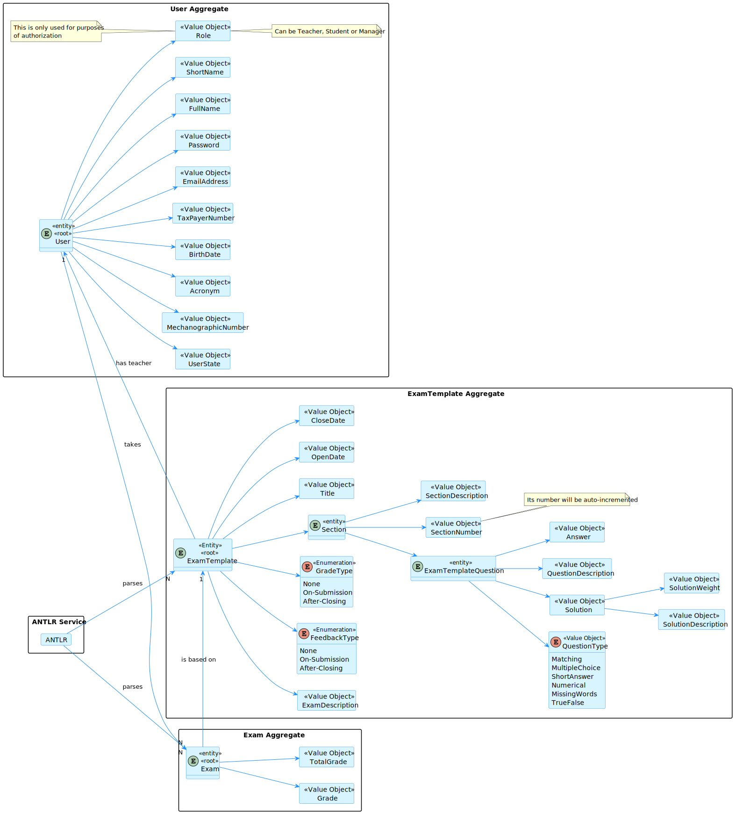
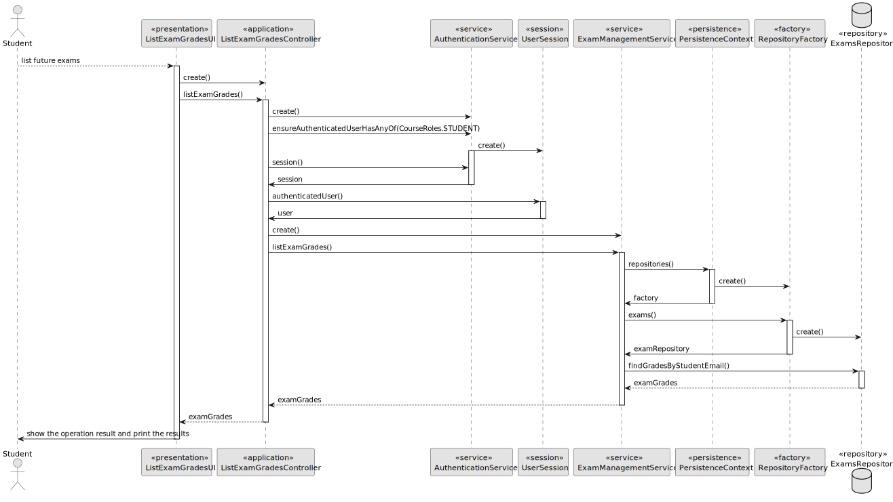

# US 2005

## 1. Context

This is the first time this task is being developed, since it was assigned in the present sprint (SPRINT C).

This [User Story](../../Glossary.md)  relates [Students](../../Glossary.md), [Exams](../../Glossary.md) and [Grades](../../Glossary.md).

Students will take an exam that will be graded and will have access to their grades.

## 2. Requirements

**US 2005** - As Student, I want to view a list of my grades.

- The Student can only view his/her own grades.
- The Student can only view the grades of the exams he/she took. 
- The Student's grade is N/A if they were in the course but did not take the exam.
- The Student's total grade is the sum of the grades of all the questions of the exams he/she took.

Regarding these requirements we understand that this User Story relates to [US2004](../US_2004/readme.md).

### 2.1 Client Specifications

## 3. Analysis

### 3.1 Domain Model

### 3.2 Implementation Analysis

## 4. Domain

### 4.1 Sequence Diagram

### 4.2 Class Diagram

### 4.3 Applied Patterns

## 5. Implementation

**ListExamGradesUI**

**ListExamGradesController**

## 6. Integration/Demonstration