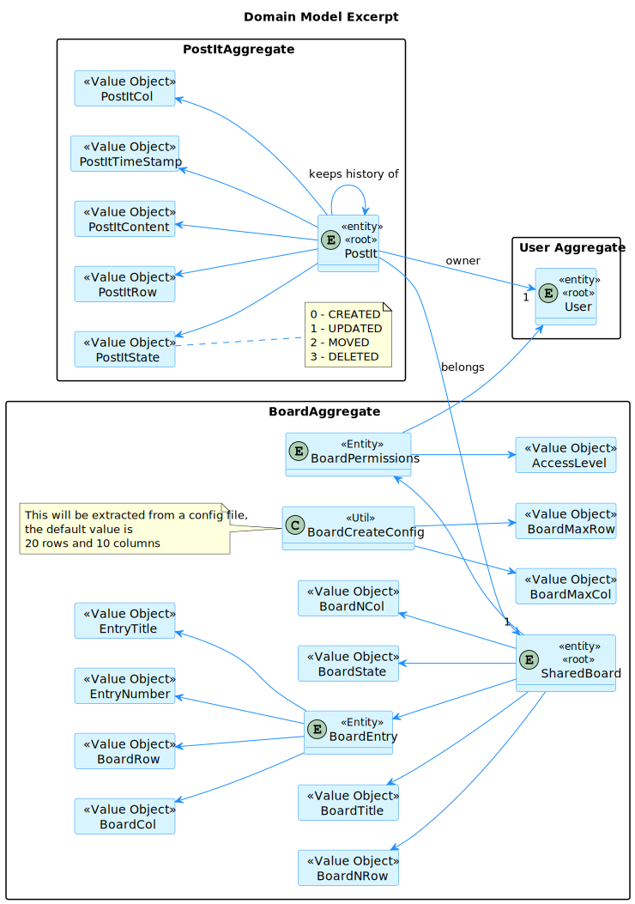
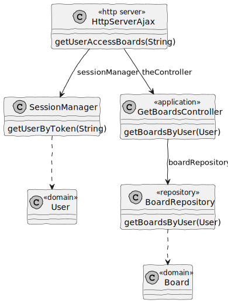

# US 3005

## 1. Context

In Sprint C client wants us to develop a feature for our System. He wants that a User to be able to view, in real-time, the updates in the shared boards.

## 2. Requirements

As User, I want to view, in real-time, the updates in the shared boards.

This functional part of the system has very specific technical requirements, particularly some concerns about synchronization problems. 
In fact, several clients will try to concurrently update boards. 
As such, the solution design and implementation must be based on threads, condition variables and mutexes. Specific requirements will be provided in SCOMP.
The client app should implement an HTTP server to be able to generate the "views" of the boards. This should be done automatically, without the intervention of the users (i.e., without reload of the web page) by using AJAX.

Dependencies:

Should have Board in system:

**US 3002:** As User, I want to create a board.

All possible updates to shared boards:

**US 3006:** As User, I want to create a post-it on a board.

**US 3007:** As User, I want to change a post-it.

**US 3008:** As User, I want to undo the last change in a post-it.


## 3. Analysis

Information in System Specification


Information in Forum

    "Uma célula pode ter mais do que um post it?" 

    Neste momento (no âmbito deste projeto) isso não será necessário. A ser possível (uma célula com mais do que 1 post-it) isso iria dificultar algumas funcionalidades, como a que permite mudar um post-it.


This is an excerpt of our domain Model, it provides the clear idea of how the Post-It should be identified according to the information in System Specification.



## 4. Design

### 4.1. Realization

#### 4.1.1. Sequence Diagram get boards user have access


### 4.2.1 Class Diagram get boards user have access



### 4.3. Applied Patterns

#### 4.3.1. Factory

- Our PersistenceContext will create a RepositoryFactory based on the configuration file then the RepositoryFactory will create the repository that we need in order to persist our domain entity.

#### 4.3.2 Service

- Services are operations or functions that are not naturally in line with the responsibility of an entity or value object. They are used to model operations that involve multiple objects or complex behaviour.

#### 4.3.3 Single Responsibility Principle (SRP)

- Ensure that each object has a clear and well-defined responsibility within the domain.

#### 4.3.4 Tell, Don't Ask

- Ensure that objects do not expose their internal state or behaviour to the outside world. On the contrary, objects should receive commands telling them what they should do, rather than being asked for information about their current state.


#### 4.3.5 Request-Response Pattern

- The web browser sends an HTTP request to the server, and the server responds with an appropriate HTTP response.

### 4.4. Tests

**Test 1:** *Get all boards with user permission successfully*

```Java
@Test
public void testGetBoardsByUser() {
    User authUser = managerUser();
    when(boardRepository.getBoardsByUser(authUser)).thenReturn(new ArrayList<>());

    getBoardsController.getBoardsByUser(authUser);

    verify(boardRepository, times(1)).getBoardsByUser(authUser);
}
```

**Test 2:** *Create a post-it with row outside of board should throw error.*

```Java

```

**Test 3:** *Create a post-it with column outside of board should throw error.*

```Java

```

## 5. Implementation

**HttpServerAjax**

```Java

````

**CreatePostItController**

```Java

````

**PostItService**

```Java

````

## 6. Integration/Demonstration

**Login into the application**


**Click on Board that you want to view**


