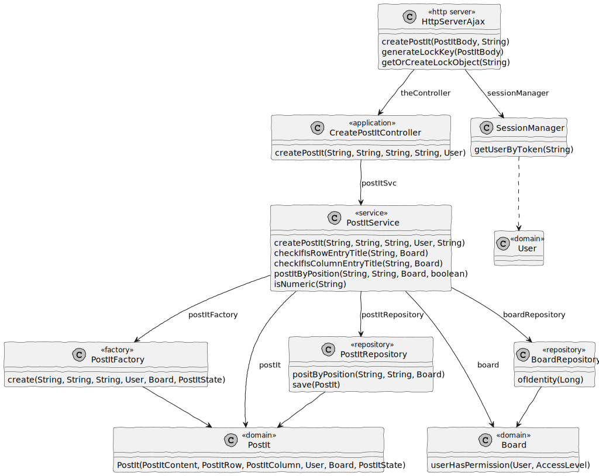

# US 3006

## 1. Context

In Sprint C client wants us to develop a feature for our System. He wants that a User to be able to create a post-it on a board.

## 2. Requirements

As User, I want to create a post-it on a board.

Dependencies:

**US 3002:** As User, I want to create a board.


## 3. Analysis

Information in System Specification

    Users with write permission may post content to a cell in the board. The content can be a text or an image. When the server commits a post it also should notify all clients with access to the board of the update.
    The system should maintain an history/log of all the updates in the board.
    The system should generate "real-time" HTML rendering of the board, presenting all the actual contents of the board, the row and column titles, the board title, the authors (short name and email) of the posts and a timestamp of each post.

Information in Forum

    "Uma célula pode ter mais do que um post it?" 

    Neste momento (no âmbito deste projeto) isso não será necessário. A ser possível (uma célula com mais do que 1 post-it) isso iria dificultar algumas funcionalidades, como a que permite mudar um post-it.

    "As stated in the system specifications document, "Columns and rows may have titles. They may also be identified by an integer number from 1 to the maximum number", we wanted to clarify if it should be possible to have a column with no title and no identifier.Also, can the identifier of a column/row change once it's assigned?"

    In order for user to post content into a cell they must identify the cell. Therefore, I think at least, ir should be possible to identify the cell by the number of its column and the number of its row. If the cells have titles, these titles can be used to identify the cells. However, it should always be possible to identify a cell by the column number and row number.
    Regarding changing the title of the columns and rows after creating the board, there is nothing explicit about that. Therefore, I would accept the solution that does not support that possibility.


This is an excerpt of our domain Model, it provides the clear idea of how the Post-It should be identified according to the information in System Specification.


## 4. Design

### 4.1. Realization

#### 4.1.1. Sequence Diagram


### 4.2. Class Diagram



### 4.3. Applied Patterns

#### 4.3.1. Factory

- Our PersistenceContext will create a RepositoryFactory based on the configuration file then the RepositoryFactory will create the repository that we need in order to persist our domain entity.

#### 4.3.2 Service

- Services are operations or functions that are not naturally in line with the responsibility of an entity or value object. They are used to model operations that involve multiple objects or complex behaviour.

#### 4.3.3 Single Responsibility Principle (SRP)

- Ensure that each object has a clear and well-defined responsibility within the domain.

#### 4.3.4 Tell, Don't Ask

- Ensure that objects do not expose their internal state or behaviour to the outside world. On the contrary, objects should receive commands telling them what they should do, rather than being asked for information about their current state.


#### 4.3.5 Request-Response Pattern

- The web browser sends an HTTP request to the server, and the server responds with an appropriate HTTP response.

### 4.4. Tests

**Test 1:** *Create a valid post-it*

```Java
@Test
void testCreatePostItSuccessful() {
    User postItOwner = managerUser();
    Board board = createBoard();

    board.addPermission(createBoardPermission(postItOwner));
    when(boardRepository.ofIdentity(123L)).thenReturn(Optional.of(board));
    when(postItRepository.positByPosition(POST_IT_ROW_COL, POST_IT_ROW_COL, board)).thenReturn(null);
    when(postItRepository.save(any(PostIt.class))).thenAnswer(invocation -> invocation.getArgument(0));

    PostIt createdPostIt = postItService.createPostIt(POST_IT_CONTENT, POST_IT_ROW_COL, POST_IT_ROW_COL, postItOwner, BOARD_ID);

    assertNotNull(createdPostIt);
    assertEquals(POST_IT_CONTENT, createdPostIt.content().value());
    assertEquals(PostItRow.of(POST_IT_ROW_COL, board.boardNRow()), createdPostIt.rowPos());
    assertEquals(PostItColumn.of(POST_IT_ROW_COL, board.boardNCol()), createdPostIt.columnPos());
    assertEquals(postItOwner, createdPostIt.owner());
    assertEquals(board, createdPostIt.board());
    assertEquals(PostItStateType.CREATED, createdPostIt.state());
    verify(postItRepository, times(1)).save(any(PostIt.class));
}
```

**Test 2:** *Create a post-it with row outside of board should throw error.*

```Java
@Test
void testCreatePostWithRowPosOutsideShouldThrowError() {
    User postItOwner = managerUser();
    Board board = createBoard();

    board.addPermission(createBoardPermission(postItOwner));
    when(boardRepository.ofIdentity(123L)).thenReturn(Optional.of(board));
    when(postItRepository.positByPosition(POST_IT_ROW_COL, POST_IT_ROW_COL, board)).thenReturn(null);
    when(postItRepository.save(any(PostIt.class))).thenAnswer(invocation -> invocation.getArgument(0));

    assertThrows(IllegalArgumentException.class, () -> {
        postItService.createPostIt(
                POST_IT_CONTENT,
                "10",
                POST_IT_ROW_COL,
                postItOwner,
                BOARD_ID);
    });
}
```

**Test 3:** *Create a post-it with column outside of board should throw error.*

```Java
@Test
void testCreatePostWithColumnPosOutsideShouldThrowError() {
    User postItOwner = managerUser();
    Board board = createBoard();

    board.addPermission(createBoardPermission(postItOwner));
    when(boardRepository.ofIdentity(123L)).thenReturn(Optional.of(board));
    when(postItRepository.positByPosition(POST_IT_ROW_COL, POST_IT_ROW_COL, board)).thenReturn(null);
    when(postItRepository.save(any(PostIt.class))).thenAnswer(invocation -> invocation.getArgument(0));

    assertThrows(IllegalArgumentException.class, () -> {
        postItService.createPostIt(
                POST_IT_CONTENT,
                POST_IT_ROW_COL,
                "10",
                postItOwner,
                BOARD_ID);
    });
}
```

## 5. Implementation

**HttpServerAjax**

```Java
package org.shared.board.server;

import eapli.framework.domain.repositories.IntegrityViolationException;
import org.apache.commons.httpclient.auth.InvalidCredentialsException;
import org.boards.controller.CreateBoardController;
import org.domain.model.BoardEntry;
import org.postit.controller.CreatePostItController;
import org.shared.board.server.request_bodys.BoardBody;
import org.shared.board.server.request_bodys.LoginBody;
import org.shared.board.server.request_bodys.PostItBody;
import org.shared.board.server.session.SessionManager;
import org.usermanagement.domain.model.User;

import java.util.*;

public class HttpServerAjax {
    SessionManager sessionManager;

    /**
     * The constant MIN_ROWS_COLUMNS.
     */
    private static final String MIN_ROWS_COLS = "1";

    Map<String, Object> lockObjects = new HashMap<>();


    public HttpServerAjax() {
        this.sessionManager = SessionManager.getInstance();
    }

    public String getAuthenticatedUser(String token)
            throws IllegalArgumentException, NullPointerException {
        String textHtml = String.valueOf(sessionManager.getUserByToken(token).identity());

        return textHtml;
    }

    public String createBoard(BoardBody requestBody, String token)
            throws IntegrityViolationException, NumberFormatException {
        CreateBoardController theController = new CreateBoardController();
        List<BoardEntry> allBoardEntrys = new ArrayList<>();
        List<String> boardEntrys = requestBody.boardEntrys();
        User authUser = sessionManager.getUserByToken(token);
        int boardNColumn = Integer.parseInt(requestBody.boardNColumn());
        int boardNRow = Integer.parseInt(requestBody.boardNRow());

        for(int i = 1; i <= boardNColumn; i++) {
            BoardEntry boardEntry = theController.createBoardEntry(
                    String.valueOf(i),
                    MIN_ROWS_COLS,
                    String.valueOf(i),
                    boardEntrys.get(i - 1),
                    requestBody.boardNRow(),
                    requestBody.boardNColumn(),
                    authUser
            );

            allBoardEntrys.add(boardEntry);
        }

        int j = boardNColumn;
        for(int i = 2; i <= boardNRow; i++){
            BoardEntry boardEntry = theController.createBoardEntry(
                    String.valueOf(i),
                    String.valueOf(i),
                    MIN_ROWS_COLS,
                    boardEntrys.get(j),
                    requestBody.boardNRow(),
                    requestBody.boardNColumn(),
                    authUser
            );

            j++;
            allBoardEntrys.add(boardEntry);
        }

        theController.createBoard(
                requestBody.boardTitle(),
                requestBody.boardNRow(),
                requestBody.boardNColumn(),
                allBoardEntrys,
                authUser);

        return "Board created successfully!";
    }

    public String login(LoginBody body)
            throws InvalidCredentialsException {
        UUID token = sessionManager.login(body.email(), body.password());

        return token.toString();
    }

    public String createPostIt(PostItBody requestBody, String token){
        CreatePostItController theController = new CreatePostItController();
        User authUser = sessionManager.getUserByToken(token);

        String lockKey = generateLockKey(requestBody);
        Object lock = getOrCreateLockObject(lockKey);

        synchronized (lock){
            theController.createPostIt(
                    requestBody.content(),
                    requestBody.row(),
                    requestBody.column(),
                    requestBody.boardId(),
                    authUser);
        }


        return "Post-It created successfully!";
    }

    private String generateLockKey(PostItBody requestBody) {
        return requestBody.row() + requestBody.column() + requestBody.boardId();
    }

    private synchronized Object getOrCreateLockObject(String lockKey) {
        return lockObjects.computeIfAbsent(lockKey, k -> new Object());
    }
}
````

**CreatePostItController**

```Java
package org.postit.controller;

import eapli.framework.application.UseCaseController;
import eapli.framework.validations.Preconditions;
import org.authz.application.AuthorizationService;
import org.authz.application.AuthzRegistry;
import org.domain.model.postit.PostIt;
import org.persistence.PersistenceContext;
import org.postit.service.PostItService;
import org.user.management.CourseRoles;
import org.usermanagement.domain.model.User;

/**
 * Controller class for adding a new post-it to the board.
 */
@UseCaseController
public class CreatePostItController {
    /**
     * Authorization service instance.
     */
    private final AuthorizationService authz;

    /**
     * Create a board service with repository injection.
     */
    private final PostItService postItSvc = new PostItService(
            PersistenceContext.repositories().postIt(),
            PersistenceContext.repositories().boards());

    /**
     * Instantiates CreatePostItController.
     */
    public CreatePostItController() {
        authz = AuthzRegistry.authorizationService();
    }


    /**
     * Create post it.
     * @param postItContentp the post-it contentp
     * @param postItRowp     the post-it rowp
     * @param postItColumnp  the post-it columnp
     * @param boardIdp       the board id
     * @return the post it
     */
    public PostIt createPostIt(final String postItContentp,
                               final String postItRowp,
                               final String postItColumnp,
                               final String boardIdp) {
        authz.ensureAuthenticatedUserHasAnyOf(CourseRoles.allRoles());

        return postItSvc.createPostIt(postItContentp, postItRowp, postItColumnp,
                authz.session().get().authenticatedUser(), boardIdp);
    }

    /**
     * Create post it.
     * @param postItContentp the post-it contentp
     * @param postItRowp     the post-it rowp
     * @param postItColumnp  the post-it columnp
     * @param boardIdp       the board id
     * @return the post it
     */
    public PostIt createPostIt(final String postItContentp,
                               final String postItRowp,
                               final String postItColumnp,
                               final String boardIdp,
                               final User authUser) {
        Preconditions.ensure(authUser != null,
                "You need to authenticate first");

        return postItSvc.createPostIt(postItContentp, postItRowp, postItColumnp,
                authUser, boardIdp);
    }
}
````

**PostItService**

```Java
package org.postit.service;

import eapli.framework.validations.Preconditions;
import org.domain.model.AccessLevelType;
import org.domain.model.Board;
import org.domain.model.postit.*;
import org.domain.repositories.BoardRepository;
import org.springframework.beans.factory.annotation.Autowired;
import org.springframework.stereotype.Service;
import org.usermanagement.domain.model.User;
import repositories.PostItRepository;

import java.text.ParseException;
import java.util.List;
import java.util.NoSuchElementException;
import java.util.Optional;
import java.util.regex.Pattern;

/**
 * The type Post-it service.
 */
@Service
public class PostItService {
    /**
     * PostItRepository.
     */
    private final PostItRepository postItRepository;

    /**
     * BoardRepository.
     */
    private final BoardRepository boardRepository;

    /**
     * Check if is a number pattern
     */
    private Pattern pattern = Pattern.compile("-?\\d+(\\.\\d+)?");

    /**
     * Instantiates a new Post-it service.
     *
     * @param postItRepo the post-it repo
     * @param boardRepo  the board repo
     */
    @Autowired
    public PostItService(final PostItRepository postItRepo,
                         final BoardRepository boardRepo) {
        postItRepository = postItRepo;
        boardRepository = boardRepo;
    }

    /**
     * Create post-it.
     *
     * @param postItContentp the post-it contentp
     * @param postItRowp     the post-it rowp
     * @param postItColumnp  the post-it columnp
     * @param postItOwner    the post-it owner
     * @param boardIdp       the board idp
     * @return the post it
     * @throws NoSuchElementException the no such element exception
     */
    public PostIt createPostIt(final String postItContentp,
                               String postItRowp,
                               String postItColumnp,
                               final User postItOwner,
                               final String boardIdp)
            throws NoSuchElementException {
        Long boardId = Long.parseLong(boardIdp);
        Board board = boardRepository.ofIdentity(boardId).get();

        postItRowp = checkIfIsRowEntryTitle(postItRowp, board);
        postItColumnp = checkIfIsColumnEntryTitle(postItColumnp, board);

        Preconditions.ensure(
                postItByPosition(
                        postItRowp,
                        postItColumnp,
                        board
                ) == null, "Already exist a Post-It in that cell!");

        Preconditions.ensure(
                board.userHasPermission(postItOwner,
                        AccessLevelType.WRITE), "You don't have "
                        + AccessLevelType.WRITE + " permission"
        );

        PostItFactory postItFactory = new PostItFactory();

        PostIt postIt = postItFactory.create(
                postItContentp,
                postItRowp,
                postItColumnp,
                postItOwner,
                board,
                PostItStateType.CREATED);

        return postItRepository.save(postIt);
    }

    /**
     * Check if already exist a Post-it in that position.
     * @param postItRowp postItRowp
     * @param postItColumnp postItColumnp
     * @param boardp boardp
     * @return PostIt
     */
    private PostIt postItByPosition(final String postItRowp,
                                    final String postItColumnp,
                                    final Board boardp){
        PostIt postIt = postItRepository.positByPosition(postItRowp,
                    postItColumnp, boardp);

        if(postIt != null
                && (postIt.state().equals(PostItStateType.DELETED)
                || postIt.state().equals(PostItStateType.MOVED))){
            return null;
        }

        return postIt;
    }

    /**
     * Check if user write EntryTitle of board
     * @param postItRowp postItRowp
     * @param board board
     * @return String
     */
    private String checkIfIsRowEntryTitle(String postItRowp, Board board){
        if(!isNumeric(postItRowp)){
            String postItRow = board.findRowByEntryTitle(postItRowp);

            if(postItRow == null){
                throw new IllegalArgumentException("This board row doesn't exist");
            }

            return postItRow;
        }

        return postItRowp;
    }

    /**
     * Check if user write EntryTitle of board
     * @param postItColumnp postItColumnp
     * @param board board
     * @return String
     */
    private String checkIfIsColumnEntryTitle(String postItColumnp, Board board){
        if(!isNumeric(postItColumnp)){
            String postItColumn = board.findColumnByEntryTitle(postItColumnp);

            if(postItColumn == null){
                throw new IllegalArgumentException("This board column doesn't exist");
            }

            return postItColumn;
        }

        return postItColumnp;
    }

    /**
     * Is numeric.
     * @param strNum the str num
     * @return the boolean
     */
    public boolean isNumeric(String strNum) {
        if (strNum == null) {
            return false;
        }

        return pattern.matcher(strNum).matches();
    }
}
````

## 6. Integration/Demonstration

