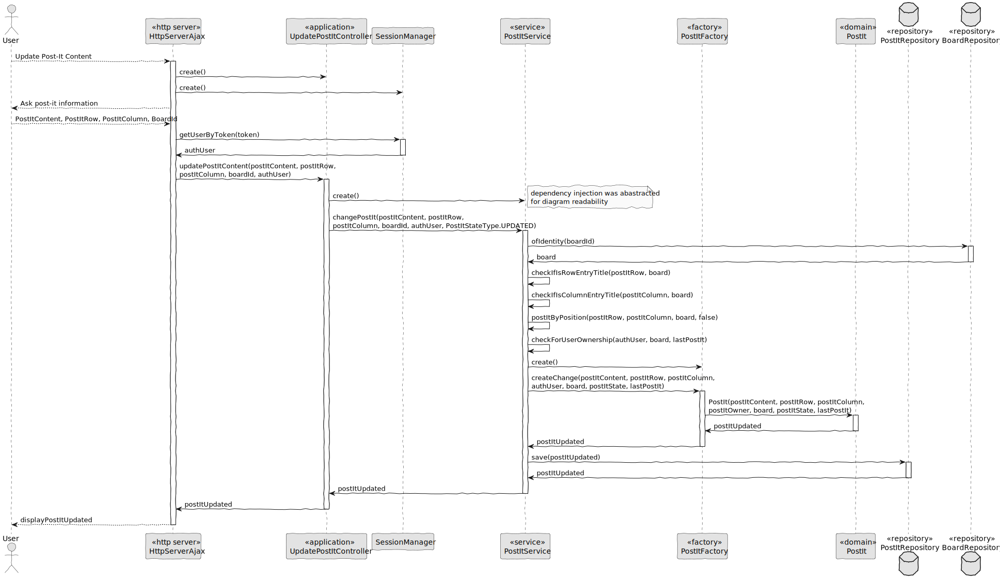

# US 3007

## 1. Context

In Sprint C client wants us to develop a feature for our System. He wants that a User to be able to change a post-it content, move a post-it to another free cell and delete post-it.

## 2. Requirements

As User, I want to change a post-it.

Dependencies:

**US 3002:** As User, I want to create a board.

**US 3006:** As User, I want to create a post-it on a board.


## 3. Analysis

Information in System Specification

    The user who created a post in a cell can change that post. It may change its contents or move the post into a free cell. The user can also undo the last change. The owner of a post can delete it.

Information in Forum

    "Uma célula pode ter mais do que um post it?" 

    Neste momento (no âmbito deste projeto) isso não será necessário. A ser possível (uma célula com mais do que 1 post-it) isso iria dificultar algumas funcionalidades, como a que permite mudar um post-it.

    "As stated in the system specifications document, "Columns and rows may have titles. They may also be identified by an integer number from 1 to the maximum number", we wanted to clarify if it should be possible to have a column with no title and no identifier.Also, can the identifier of a column/row change once it's assigned?"

    In order for user to post content into a cell they must identify the cell. Therefore, I think at least, ir should be possible to identify the cell by the number of its column and the number of its row. If the cells have titles, these titles can be used to identify the cells. However, it should always be possible to identify a cell by the column number and row number.
    Regarding changing the title of the columns and rows after creating the board, there is nothing explicit about that. Therefore, I would accept the solution that does not support that possibility.


This is an excerpt of our domain Model, it provides the clear idea of how the Post-It should be identified according to the information in System Specification.


## 4. Design

### 4.1. Realization

#### 4.1.1. Sequence Diagram change post-it content



### 4.2 Class Diagram

#### 4.2.1 Class Diagram change post-it content


### 4.3. Applied Patterns

#### 4.3.1. Factory

- Our PersistenceContext will create a RepositoryFactory based on the configuration file then the RepositoryFactory will create the repository that we need in order to persist our domain entity.

#### 4.3.2 Service

- Services are operations or functions that are not naturally in line with the responsibility of an entity or value object. They are used to model operations that involve multiple objects or complex behaviour.

#### 4.3.3 Single Responsibility Principle (SRP)

- Ensure that each object has a clear and well-defined responsibility within the domain.

#### 4.3.4 Tell, Don't Ask

- Ensure that objects do not expose their internal state or behaviour to the outside world. On the contrary, objects should receive commands telling them what they should do, rather than being asked for information about their current state.


#### 4.3.5 Request-Response Pattern

- The web browser sends an HTTP request to the server, and the server responds with an appropriate HTTP response.

### 4.4. Tests

**Test 1:** *Test update post-it content successfully.*

```Java
@Test
void testUpdateContentSuccessful() {
    User postItOwner = managerUser();
    Board board = createBoard();
    PostItFactory postItFactory = new PostItFactory();

    board.addPermission(createBoardPermission(postItOwner));
    when(boardRepository.ofIdentity(123L)).thenReturn(Optional.of(board));

    PostIt existingPostIt = postItFactory.create(
            POST_IT_CONTENT,
            POST_IT_ROW_COL,
            POST_IT_ROW_COL,
            postItOwner,
            board,
            PostItStateType.CREATED
    );

    when(postItRepository.positByPosition(POST_IT_ROW_COL, POST_IT_ROW_COL, board)).thenReturn(existingPostIt);
    when(postItRepository.save(any(PostIt.class))).thenAnswer(invocation -> invocation.getArgument(0));

    String updatedContent = "Updated Post-it Content";
    PostIt updatedPostIt = postItService.updateContent(updatedContent,
            POST_IT_ROW_COL, POST_IT_ROW_COL, BOARD_ID, postItOwner);

    assertNotNull(updatedPostIt);
    assertEquals(updatedContent, updatedPostIt.content().value());
    assertEquals(PostItRow.of(POST_IT_ROW_COL, board.boardNRow()), updatedPostIt.rowPos());
    assertEquals(PostItColumn.of(POST_IT_ROW_COL, board.boardNCol()), updatedPostIt.columnPos());
    assertEquals(postItOwner, updatedPostIt.owner());
    assertEquals(board, updatedPostIt.board());
    assertEquals(PostItStateType.UPDATED, updatedPostIt.state());
    verify(postItRepository, times(1)).save(any(PostIt.class));
}
```

**Test 2:** *Test move post-it to another cell successfully.*

```Java

```

**Test 3:** *Test delete post-it successfully.*

```Java

```

## 5. Implementation

**HttpServerAjax**

```Java

````

**UpdatePostItController**

```Java

````

**PostItService**

```Java

````

## 6. Integration/Demonstration

**Login into the application**


**Click on Board that you want to update a Post-It**


