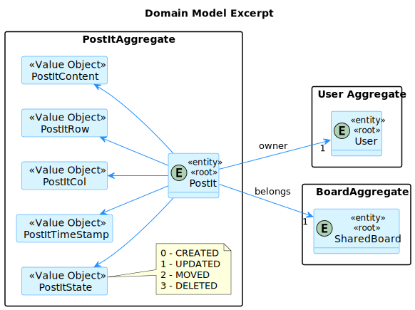

# US 3008 - As a User, I want to undo the last change in a post-it

## 1. Context

> In this user story, we will have to undo a post-it which ultimately means that we need to have a history of the changes, so the post-it will hold its past state (a newly created post-it will have that at null).

> There is another case we have to think separately, undoing a deleted post-it, so we will treat this user story as if it was two different user stories.

> For undoing a post-it, it will search its previous reference and insert it in the database as a new one.

> For undoing a deleted post-it, we will click undo post-it in an empty board entry, and if it has a previous reference, the old post-it will pop up in that position.

## 2. Requirements

> In order for the post-it to be undone, we need to have **post-its** in a **board** and a **history** of the changes.

So, the predefined dependencies are:

- US 3005 (we need to view the board in order to undo a post-it)
- US 3006 (we need to have post-its in the board in order to undo one)
- US 3007 (we need to have a history of the changes in order to undo a post-it)

> Related to authorization, the only rule we have is that the user must be logged in and have access to the board, which is previously verified in the dependencies.
Any type of user can undo a post-it, so no need for server-side authorization, just the login.

## 3. Analysis

- As we can see, this 3 aggregates are essential to the execution of the user story, as a post-it **belongs to** a board **of a** user.

> ⚠️ This functionality is still under development. Please be patient.

## 4. Design

### 4.1. Realization

### 4.2. Class Diagram

### 4.3. Applied Patterns

### 4.4. Tests

## 5. Implementation

## 6. Integration/Demonstration