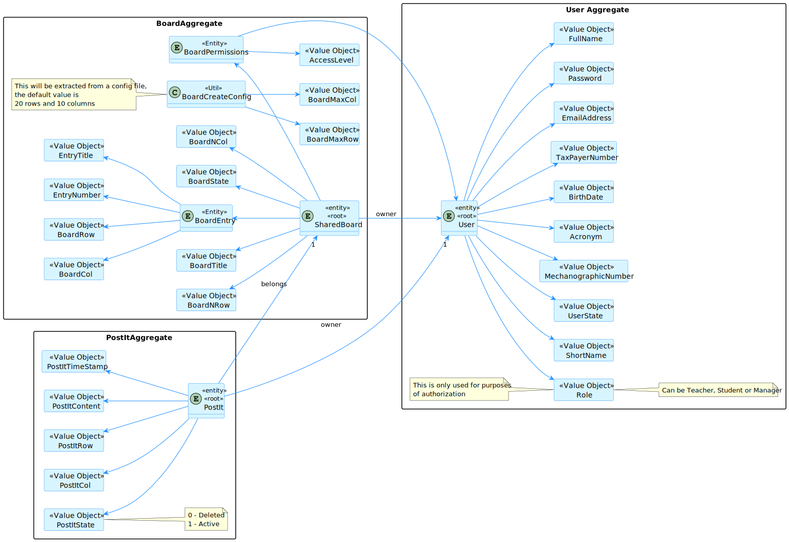
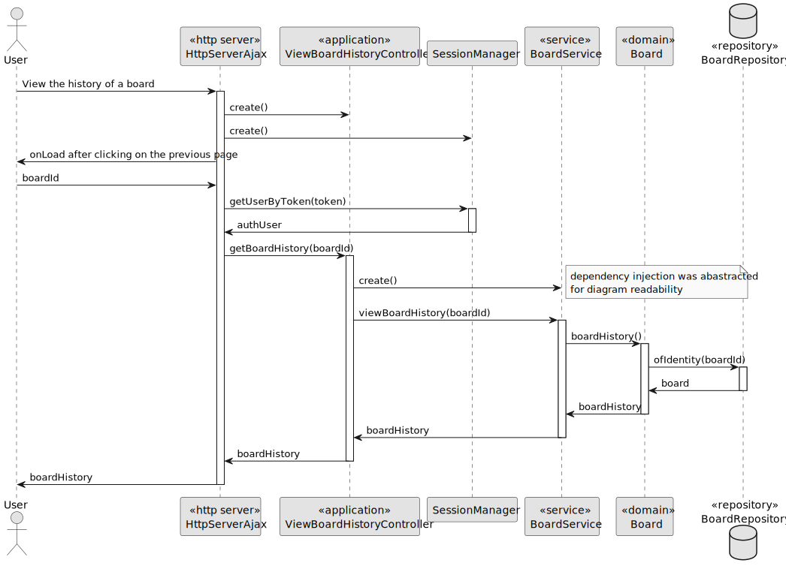
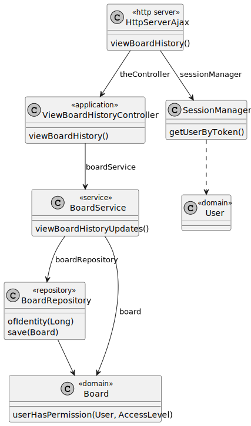

# US 3009

## 1. Context

This is the first time this task is being developed, since it was assigned in the present sprint (SPRINT C).

This [User Story](../../Glossary.md)  relates [Users](../../Glossary.md) and [Boards](../../Glossary.md).

Users will be able to view the history of the boards.

## 2. Requirements

**US 3009** - As User, I want to view the history of updates on a board.

- The User can only view the history of updates on a board if he/she is the owner of the board or if he/she is a member of the board (has read permissions)
- The User can only view the history of updates on a board if the board exists.

Regarding these requirements we understand that this User Story relates to [US3004](../US_3004/readme.md).

### 2.1 Client Specifications

## 3. Analysis

### 3.1 Domain Model

### 3.2 Implementation Analysis

## 4. Domain

### 4.1 Sequence Diagram

### 4.2 Class Diagram

### 4.3 Applied Patterns

Some main design patterns were applied in this functionality, namely:
- **Single Responsibility Principle (SRP)**: A class should have only one reason to change and only one responsibility.

## 5. Implementation

**ViewBoardHistoryUpdatesController**

## 6. Integration/Demonstration